= 网络代理使用文档
作者 <padeoe@gmail.com>
v1.0
:toc: left
:toc-title: 目录
:last-update-label: 最后更新
:version-label: 版本
:source-highlighter: pygments
:pygments-style: manni
:listing-caption: Listing
:sectanchors:
:sectnums:
//:!webfonts:

:proxy_hostname: proxy.example.com
:proxy_name: proxy_name
:proxy_https_port: 5678
:ysocks_port: 8888

//command: asciidoctor proxy.adoc

== 简介

本网站提供 VPN、https 代理、V2ray等多种代理方式，使用简介如下。

== VPN
=== Windows
仅支持 Windows 7 及以上系统，不支持 Windows XP。需要在网络和共享中心中添加和配置 VPN。
对于 Windows 10，支持使用 Powershell 命令一键创建 VPN 配置。

==== 方法1: Powershell 命令配置 VPN
点击系统左下角 Windows 徽标搜索 Powershell 并打开。

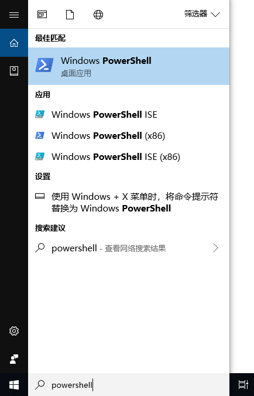

输入如下命令并回车：
//[source,bash,indent=0,options="nowrap",subs="attributes"]
[source,PowerShell,subs="attributes"]
----
Add-VpnConnection -Name {proxy_name} -ServerAddress {proxy_hostname} -AuthenticationMethod Eap -EncryptionLevel Required -RememberCredential -TunnelType Ikev2
----
执行完会在系统中创建命令中 `-Name` 后名字的网络连接，在系统右下角网络中点击该网络连接进行连接。

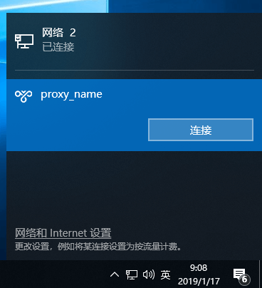

==== 方法2: 网络共享中心引导程序配置 VPN
在 Windows 控制面板中找到并打开网络和共享中心，顺次选择 `设置新的连接或网络` - `连接到工作区` -
`使用我的Internet连接(VPN)`。

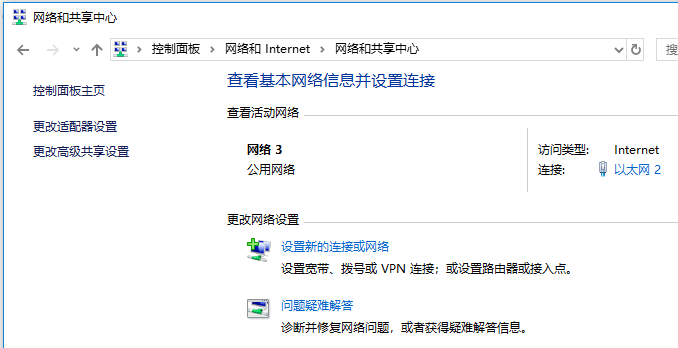
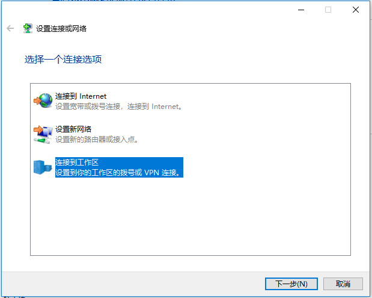
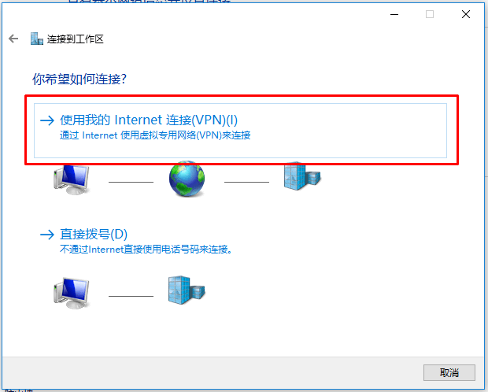
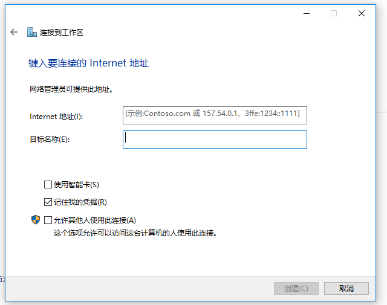

`Internet 地址` 填写 **{proxy_hostname}**。
`目标名称` 指的是 VPN 名称，可以随意填写，如 {proxy_name}。填写完毕点击创建。

创建完毕，在系统右下角网络中找到名为 {proxy_name} 的网络连接并点击连接。

=== Android
支持两种方式配置 VPN，一种是利用系统设置中自带的 VPN 配置页面，一种是安装 Strongswan App 来配置 VPN。
区别是前者建立的是 IPSec Xauth PSK 类型的VPN，后者建立的是 IKEv2 EAP 认证的 VPN，且可以配置分应用分流。
前者好像不是很稳，推荐安装 app。

==== 使用 StrongSwan 配置 VPN

+++<a href="file/strongswan.apk" download="" target="_blank">点此下载</a>+++ 客户端 Strongswan.apk，安装后打开，
点击右上角 `添加VPN配置` 填写配置：

* 服务器地址：**{proxy_hostname}**
* VPN类型：`IKEv2 EAP(用户名/密码)`
* 配置名称：可选填，如 {proxy_name}

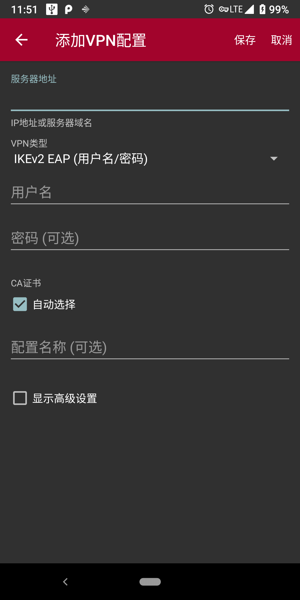

填好后保存。点击刚才创建的 {proxy_name} 进行连接。

=== iOS
依次打开 `设置`-`通用`-`VPN`，添加VPN，类型可以选择 `IKEV2`，也可以选择 `IPSec`。
并填写如下信息（注意如果选择 `IPSec`，需要填写预共享密钥，`IKEV2` 则不需要）：

- 描述：用于指定配置名称，可以随意填写，如 {proxy_name}
- 服务器：**{proxy_hostname}**
- 帐户：代理账号用户名。
- 密码：代理账号密码。
- 密钥：预共享密钥。

没有提到的输入项保持默认值即可。
填写完毕点击右上角完成，返回 VPN 配置列表页面，选择刚刚新建的 {proxy_name} 配置，然后点击连接。

=== Mac OS
在网络偏好设置中点击 **+** 号新增 VPN 连接，选择 VPN 类型为 `Cisco IPSec`，
服务器地址为 **{proxy_hostname}**，此外填写用户名密码，`鉴定设置` 中 `共享的密钥` 填写预共享密钥。
其余保持默认配置，保存并连接。

== https 代理
https 代理只能在 Chrome 中结合 SwitchyOmega 插件使用，支持在 Windows、Linux、Mac OS 的 Chrome 中使用。

=== 安装 Chrome 和 SwitchyOmega 插件
==== Chrome
下载 Chrome 安装包并完成安装。

* 官方 https://www.google.com/intl/en/chrome/browser/desktop/index.html?standalone=1[下载地址]
* 本站保存的 +++<a href="file/ChromeStandaloneSetup64.exe" download="" target="_blank">ChromeStandaloneSetup64.exe</a>+++

==== SwitchyOmega 插件
在 Chrome 中安装 SwitchyOmega 插件。

打开 https://chrome.google.com/webstore/search/Proxy%20SwitchyOmega[Chrome 扩展商店]，
搜索选择 Proxy SwitchyOmega，点击 `Add to Chrome` 按钮将该插件添加到 Chrome 中。

如果无法访问 Chrome 扩展商店进行在线的插件安装，可以直接下载插件的离线 crx 包。

* 官方 https://github.com/FelisCatus/SwitchyOmega/releases[下载地址]
* 本站保存的 +++<a href="file/SwitchyOmega.crx" download="" target="_blank">SwitchyOmega.crx</a>+++

下载后，打开 Chrome 的扩展管理页面: chrome://extensions/，
并将下载好的 SwitchyOmega.crx 文件拖动进入插件管理页面。
注意对于高版本的 Chrome，需要在插件页面开启 **Developer mode** 并刷新管理页面后进行操作。

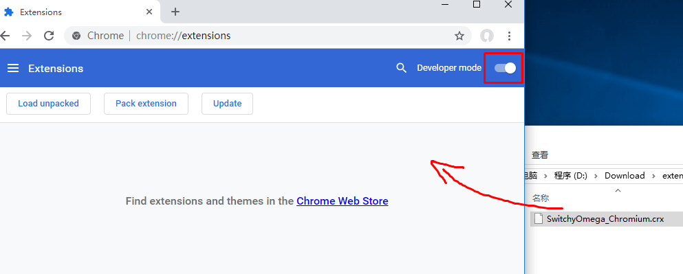

=== 配置 SwitchyOmega
打开 SwitchyOmega 的配置界面，选中左边默认的代理配置 proxy 或者新建情景模式-代理服务器，在输入框中填写以下配置：

* 协议：**HTTPS**
* 服务器地址： **{proxy_hostname}**
* 端口：**{proxy_https_port}**

然后点击端口右边的锁状图标，填写用户名密码。填写完毕后，点击应用更改。

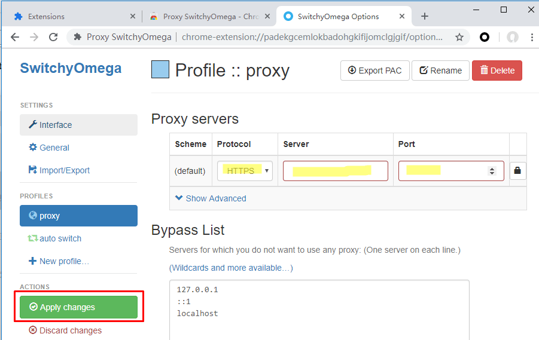

=== 应用 https 代理
点击浏览器右上角 SwitchyOmega 图标，选中刚才创建的代理，就可以开始愉快的浏览网页了。

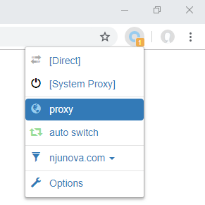

更多 SwitchyOmega 的使用技巧，例如国内外域名分流，配置的导入导出等，可参考 https://www.switchyomega.com/settings/[官网介绍]。

== V2ray
V2ray 支持 Windows、Mac OS、Linux、Android、iOS系统。所有配置信息可以由一份 config.json 文件定义，
+++<a href="file/config.json" download="" target="_blank">点此下载</a>+++ config.json 文件。

=== Android
下载安装 Android 客户端。

* BifrostV
** https://play.google.com/store/apps/details?id=com.github.dawndiy.bifrostv[Google Play]
** +++<a href="file/BifrostV.apk" download="" target="_blank">本站保存的 BifrostV.apk</a>+++
* Actinium
** https://github.com/V2Ray-Android/Actinium/releases[Github]
** +++<a href="file/Actinium.apk" download="" target="_blank">本站保存的 Actinium.apk</a>+++

打开客户端，根据提示导入 config.json 文件创建代理配置，然后选择创建的代理配置连接。

=== iOS
iOS 客户端目前需要使用美区 App Store 下载，且没有免费客户端。客户端包括
https://itunes.apple.com/us/app/kitsunebi-proxy-utility/id1446584073?mt=8[Kitsunebi]、
https://www.v2ray.com/itunes/us/kitsunebi-lite/id1387913765/[Kitsunebi Lite]、
https://www.v2ray.com/itunes/us/shadowrocket/id932747118/[Shadowrocket]、
https://www.v2ray.com/itunes/us/quantumult/id1252015438/[Quantumult]、
https://www.v2ray.com/itunes/us/pepi/id1283082051/[Pepi] 等。

=== 其他系统
参见 https://www.v2ray.com/ui_client/[V2ray 官网介绍]。

== YSocks 代理
仅支持 Windows 平台，为本站自有客户端和协议。
YSocks 代理的原理是，在本地计算机开一个客户端，客户端和服务器通过特有协议（加密）防止被墙，
客户端会仅在本机开启一个标准的 Socks 代理（不加密），
应用程序通过内部的代理设置使用这个本地 `Socks5` 代理（因为本地通信没有墙）来上网，因此本地

=== 安装 YSocks 客户端
下载 +++<a href="file/ysocks.zip" download="" target="_blank">Ysocks 客户端</a>+++，解压后有两个文件：主程序+配置文件。

配置文件是Json格式，可以继续添加多个代理。直接双击主程序即可启动本地Socks代理。 配置项有三个：

* local_port: 本地端口，可以自己指定。默认为 1080
* remote_host: 远程服务器地址，可以使用域名或者ip
* remote_port: 远程服务器端口，本站固定为 {ysocks_port}

默认的配置文件是可以直接用的。可以自行根据需求调整本地端口或远程服务器地址。

=== 使用 Socks 代理
Socks 代理只支持内部允许设置代理的应用程序，
笔者使用的程序譬如 Chrome、IDM、Spotify 都是支持的。
其设置大同小异，只要确保设置中，代理类型是 `Socks5`，服务器地址是 **127.0.0.1**，
端口填写客户端配置的本地端口，如 YSocks 默认配置为 **1080**。

譬如 IDM 的代理设置：

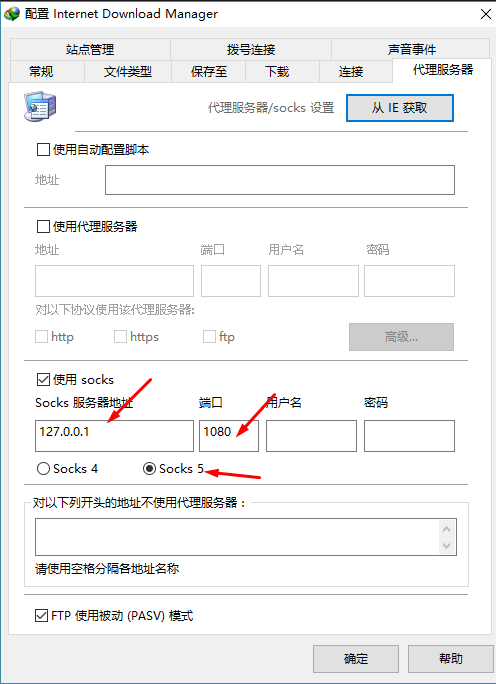

Spotify 的代理设置：

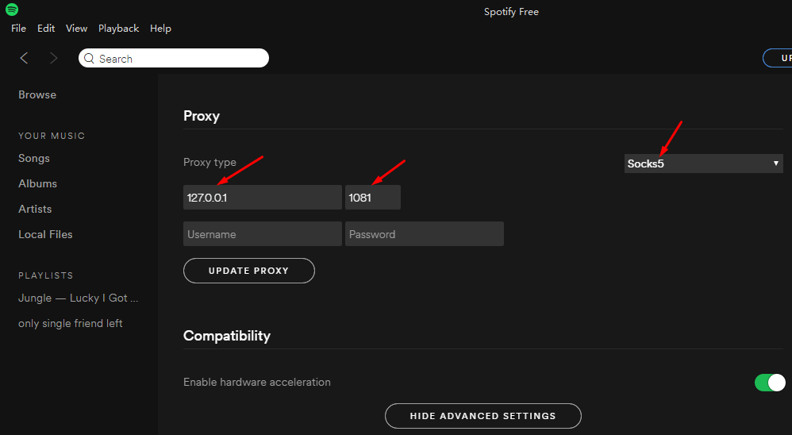

=== 在 Chrome 中使用 Socks 代理
==== 安装 Chrome 和 SwitchyOmega 插件
参考 https 代理配置文档中的 <<安装 Chrome 和 SwitchyOmega 插件>> 。
==== 在插件中配置代理
打开 SwichyOmega 的配置界面，`新建情景模式`-`代理服务器`。

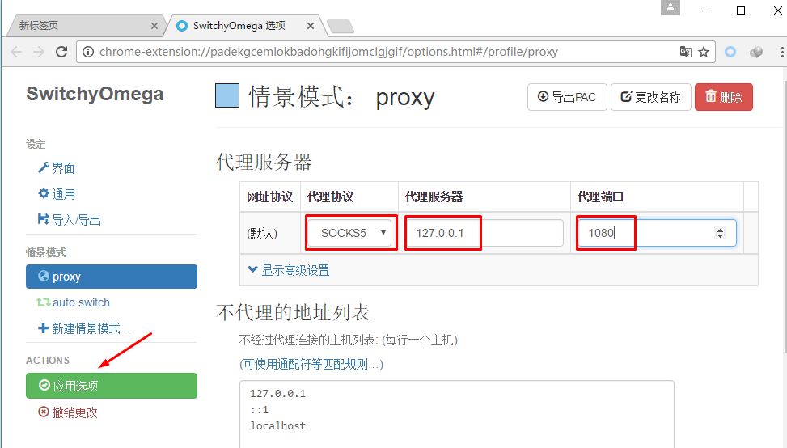
如图填写，确保协议是 **Socks5**，服务器地址是 **127.0.0.1**，端口是客户端配置的本地端口
（YSocks 默认为 **1080**）。

填写完毕后，点击应用更改。

==== 使用 Socks 代理
在浏览器右上角选中刚才创建的代理，就可以开始愉快的浏览网页了。

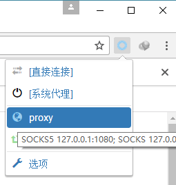
